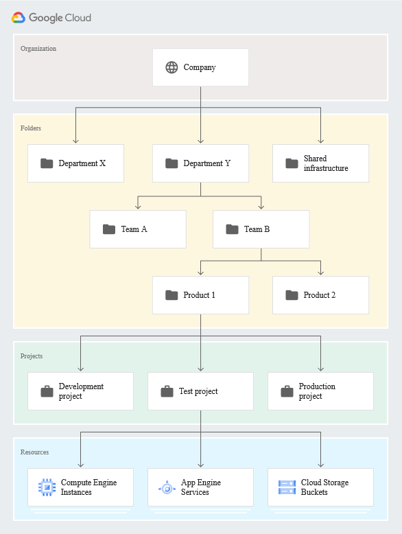

[[_TOC_]]
# Introduction
## ORG . Folder . Project
  

## Access: IAM
  * Policy: Role binding between Pricipals (user, group, svc account, ...) and Roles
  * **WHO** Principals:
    * Google Account
    * Service account
    * Google group
    * Google Workspace account
    * Cloud Identity domain
    * All authenticated users
    * All users
  * **Can do what** Roles
    * Basics
    * Predefined
    * Custom 

## IAM

* IAM: https://cloud.google.com/iam/docs/overview

## Regions & Zones
* Region contains 3 or more zones

## GKE
https://cloud.google.com/kubernetes-engine/docs/concepts/types-of-clusters
https://cloud.google.com/kubernetes-engine/docs/concepts/kubernetes-engine-overview
* Autopilot : Fully-provisioned and managed Cluster
* Standard : We can define and manage Cluster
### Networking
* Network Routing: 
  * VPC-native cluster
  * Route-based cluster
* To Deploy Ingress internal HTTP(s) load balancer `ingress.class: “gce-internal”` we should anootate service with a NEG ref 
  * NEG: Network Endpoint Groups `cloud.google.com/neg: '{"ingress": true}'`
  * https://cloud.google.com/kubernetes-engine/docs/concepts/ingress-ilb
  * https://cloud.google.com/kubernetes-engine/docs/how-to/internal-load-balance-ingress
* To Deploy Ingress External HTTP(s) load balance `ingress.class: “gce”`
  * https://cloud.google.com/kubernetes-engine/docs/concepts/ingress-xlb
  * https://cloud.google.com/kubernetes-engine/docs/how-to/load-balance-ingress

 

## Cloud run
https://cloud.google.com/run/docs/quickstarts?hl=en#build-and-deploy
* easiest deploiment methode :
  * Cloud run ==> GKE ==> Compute
* https://cloud.google.com/run/docs/about-instance-autoscaling
  * We can set au min instances / max instances 
  * we can set concurrency to handle how many user can connect to a particular instance

## Cloud Functions:
https://cloud.google.com/functions/docs/calling 
* Serverless function execution trggered by an event

## Storage
https://cloud.google.com/storage/docs/creating-buckets
https://cloud.google.com/storage/docs/introduction
* Storage class it depends on your needs:
  * Standard is for immediate access and has no minimum storage duration
  * Nearline has a 30 day minimum duration and data retrieval charges
  * Coldline has a 90 day min duration and data retrieval charges
  * Archive has a 365 day min duration and data retrieval charges
* Lifecycle: https://cloud.google.com/storage/docs/lifecycle (Exple )
    * Downgrade the storage class of objects older than 365 days to Coldline storage.
    * Delete objects created before January 1, 2019.
    * Keep only the 3 most recent versions of each object in a bucket with versioning enabled.

## VPC 
https://cloud.google.com/vpc/docs/vpc
* Automode: auto-creation of network when we create a ressources in any region
* Custom: creation of ressources allowed only in the configured region
* Expand ip range
  * expand ip range within a VPC by reducing your subnet mask
  * it can be undone
  * 

## Compute
https://cloud.google.com/compute/docs/disks/snapshots
* Persistent disk snapshots : backup disk 
  * we can create a schedule snapshot
  * Only the first one is a fullsnapshot
  * Snapshot N+1 contains only updated block of snapshot N

### Instance template
https://cloud.google.com/compute/docs/instance-templates
* Used to create a MIG or VM
### Managed Instance Group: 
  * Availability
  * Scalability 
  * Automated Update
https://cloud.google.com/compute/docs/instance-groups/creating-groups-of-managed-instances 
https://cloud.google.com/compute/docs/instance-groups

# Monitoring 
https://cloud.google.com/monitoring/alerts/using-alerting-ui
https://cloud.google.com/monitoring/alerts
* WHAT => HOW => WHO

# Tuto:
* Perform Foundational Infrastructure Tasks in Google Cloud: (https://www.qwiklabs.com/quests/118)
* Set Up and Configure a Cloud Environment in Google Cloud: (https://www.qwiklabs.com/quests/119)
* Create and Manage Cloud Resources: (https://www.qwiklabs.com/quests/120)
* https://www.cloudskillsboost.google/paths/11
